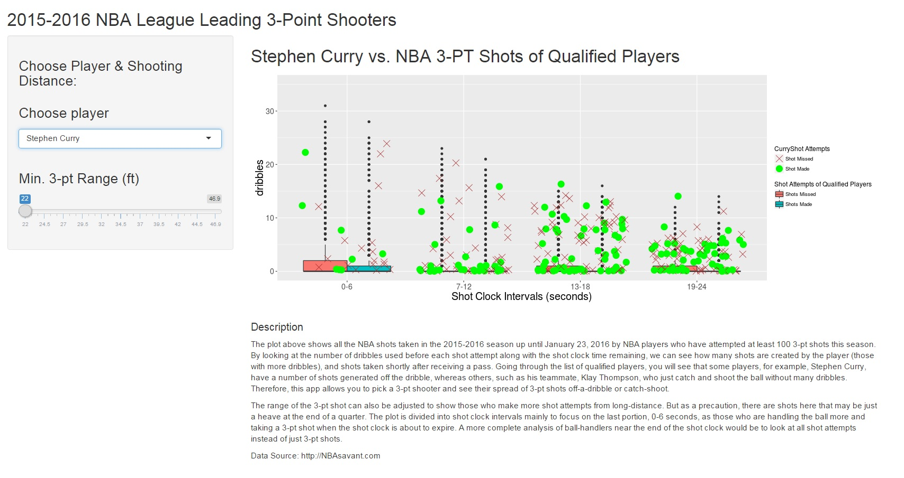

ShinyAppPresentation
========================================================
author: Sinto Ling
date: March 6, 2016

Motivation
========================================================
This shiny application is part of the Developing Data
Products course from the Coursera Data Science 
specialization from John Hopkins University Bloomberg 
School of Public Health. 

I have enjoyed watching the Golden State Warriors, an
NBA basketball team in the USA play for a couple years,
and I wanted to look at how Stephen Curry and Klay 
Thompson fair against the NBA 3-pt shooters. So I
decided to do this assignment based on the data from
http://nbasavant.com. The data I used is updated only 
through to January 23rd, 2016.

My Shiny App
========================================================
On my shiny app, the user selects an NBA 3-pt shooter
whom has taken at least 100 3-pt shots in the current 
season (2015-2016). The user can also choose to move the
slider for the minimal shot distance that the 3-pt shots
were taken from. 

My shiny app can be found here:
https://lingsin5234.shinyapps.io/ShinyAppProject/

The source code is available at my github repo:
https://github.com/lingsin5234/

Functionality
========================================================
After the player and minimum 3-pt range are chosen,
the app will automatically update the results in the
main panel. The plot shown is a result of filtering
the player and range from the 3-pt shooting data.


```r
ggplot() + 
geom_boxplot(data=nba[nba$shot_distance >= shotdist(),], 
    aes(shotClkInt, dribbles, fill=shot_made_flag)) +
geom_jitter(data=nba[nba$name==player() & 
                    nba$shot_distance >= shotdist(),], 
    aes(shotClkInt, dribbles, colour=shot_made_flag, 
        shape=shot_made_flag), size=5)
```

Sample Result
========================================================
Here is a sample result from my shiny app:

